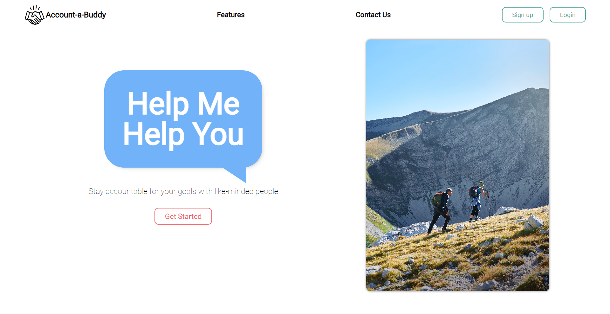

# [Account-A-Buddy](https://account-a-buddies.herokuapp.com)

Account-A-Buddy is a MERN stack web application that helps users keep track of their goals with a big emphasis on partner-based accountability. Each user is anonymously matched with someone who has a similar goal to either make or break a habit. This gives the user someone they can share their struggles and successes with as they try to complete their goal. The more accountability you have, the greater likelihood of success. Set your goals and find a buddy who will keep you motivated!

## ⚡ Languages & Technologies
Languages: HTML5, CSS3, JavaScript
 
Backend: Express.js, MongoDB, Mongoose, SocketIO
 
Frontend: React,Redux, Node.js, Axios
 
Hosting: Heroku

## ⚙️ Functionalities
- 🚦 User Authentication
    - Users can create an account and login to their profile
- ⛳ Goals CRUD
    - Users can create goals and subgoals
- 😀 Daily Reaction Tracker CRUD
    - Users can record their emotion to each one of their goals once a day
- 🤝 User can be paired with another user to be their anonymous accountability partner
    - Users are paired based on their goal category: habit forming or breaking
- 💬 Live Chat CRUD
    - Users can live chat with their partner in a private chatroom about their goal
    - Users can also unmatch with a partner and be matched with another random user

## Team Members
⭐ [Samuel Song](https://www.linkedin.com/in/samsongs1991/) - Team Lead & Live Chat
 
⭐ [Ben Chai](https://www.linkedin.com/in/ben-chai/) - Flex
 
⭐ [Jenny Nhan](https://www.linkedin.com/in/jennynhan/) - Backend
 
⭐ [Zamin Kugshia](https://www.linkedin.com/in/zamin-k/) - Frontend
